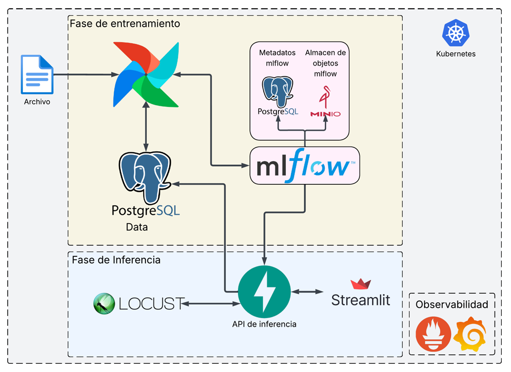

# MLOps Platform - Kubernetes Deployment (Proyecto 2)

## Integrantes del grupo

- Carlos Manuel Carvajales Castrillo
- Mateo Ruiz Mendoza

## 📋 Descripción General

**MLOPS-Proyectos-entrega-2** es una plataforma completa de **MLOps (Machine Learning Operations)** diseñada para desplegar pipelines de machine learning en **Kubernetes (Minikube)** con arquitectura de microservicios. El sistema automatiza el ciclo completo de vida del ML: desde la ingesta de datos, procesamiento, entrenamiento de modelos, hasta su inferencia en producción, con monitoreo integral y pruebas de carga.

### 🎯 Casos de Uso

- Automatización de pipelines de ML con **Apache Airflow**
- Almacenamiento distribuido de artefactos y datos con **MinIO**
- Tracking y gestión de experimentos con **MLflow**
- APIs RESTful para obtención de datos e inferencia
- Monitoreo en tiempo real con **Prometheus** y **Grafana**
- Pruebas de carga y stress testing con **Locust**
- Interfaz de usuario interactiva con **Streamlit**

---

## 🏗️ Arquitectura de Microservicios



### 📦 Componentes

| Servicio | Puerto | Función |
|----------|--------|---------|
| **Airflow Webserver** | 8080 | Orquestación de pipelines ML |
| **Airflow Scheduler** | - | Coordinador de tareas |
| **Airflow Worker** | - | Ejecución distribuida |
| **MySQL** | 3306 | Base de datos de metadatos |
| **Redis** | 6379 | Broker de mensajes (Celery) |
| **MinIO Console** | 9001 | Interfaz de almacenamiento S3 |
| **MinIO API** | 9000 | API S3-compatible |
| **MLflow** | 5000 | Registry y tracking de modelos |
| **API Inference** | 8001 | Predicciones ML |
| **API GetData** | 8003 | Obtención de datos |
| **Prometheus** | 9090 | Recopilación de métricas |
| **Grafana** | 3000 | Visualización de métricas |
| **Locust** | 8089 | Testing de carga |
| **Streamlit** | 8501 | Interfaz web del usuario |

### 📊 Consumo de Recursos Observado

Mediciones reales después de 7 horas de operación estable:

| Servicio | CPU (cores) | Memoria |
|----------|-------------|---------|
| **airflow-scheduler** | 127m | 349Mi |
| **airflow-webserver** | 70m | 877Mi |
| **airflow-worker** | 73m | 1,993Mi ⚠️ |
| **airflow-triggerer** | 13m | 293Mi |
| **mlflow** | 23m | 2,007Mi ⚠️ |
| **postgres** | 35m | 93Mi |
| **mysql-db** | 11m | 417Mi |
| **prometheus** | 2m | 23Mi |
| **grafana** | 12m | 212Mi |
| **minio** | 1m | 122Mi |
| **api-inference** | 5m | 190Mi |
| **get-data-api** | 2m | 134Mi |
| **locust** | 1m | 40Mi |
| **TOTAL SERVICIOS** | **~384m** | **~8,350Mi (~8.1GB)** |

**⚠️ Nota Importante**: 
- MLflow y Airflow Worker son los mayores consumidores de recursos
- El uso total es de ~8-9GB en estado estable
- Minikube + Docker Desktop usan aproximadamente 2-3GB adicionales
- **Consumo total del sistema**: 10-12GB (de los 14GB asignados)

---

## 📋 Requisitos Previos

### Software Requerido

- **Docker** v20.10+
- **Minikube** v1.25+
- **kubectl** v1.24+
- **Python** 3.9+ (para DAGs locales)
- **Git**

### Especificaciones Recomendadas del Sistema

⚠️ **IMPORTANTE**: Basado en mediciones reales de consumo (7 horas en estado estable):

- **RAM Total**: **14GB mínimo** (todos los servicios + overhead de Minikube)
  - Consumo promedio de servicios: 8-9GB
  - Overhead de Minikube + Docker: 2-3GB
- **CPU**: **6 cores mínimo** (4 cores es insuficiente y causa throttling)
- **Almacenamiento**: 20GB libres

**Notas Importantes**:
- Con 8GB de RAM + 4 cores, Minikube se sobrecarga y los servicios funcionan lentamente
- Minikube utiliza recursos adicionales para sus propios procesos (kubelet, scheduler, etc.)
- Se recomienda asignar al menos 14GB de RAM para operación estable

### Inicializar Minikube

```bash
# Crear cluster con recursos suficientes (RECOMENDADO)
minikube start \
  --cpus=6 \
  --memory=14336 \
  --driver=docker \
  --nodes=1

# Habilitar addons necesarios
minikube addons enable ingress
minikube addons enable metrics-server

# Verificar que Minikube está con los recursos correctos
minikube status
kubectl top nodes
```

### Monitorear Uso de Recursos de Minikube

```bash
# Ver consumo de CPU y memoria en tiempo real
kubectl top nodes
kubectl top pods -A

# Ver límites y requests configurados
kubectl describe nodes
```

---

## 🚀 Instalación y Despliegue

### 1️⃣ Clonar Repositorio

```bash
git clone <repository-url>
cd MLOPS-Proyectos-entrega-2
```

### 2️⃣ Configurar Namespace

```bash
# Crear namespace dedicado
kubectl create namespace mlops

# Establecer como default
kubectl config set-context --current --namespace=mlops
```

### 3️⃣ Desplegar Manifiestos Kubernetes

**IMPORTANTE**: Respetar el orden de despliegue indicado a continuación.

#### Paso 1: Secretos y Configuración

```bash
kubectl apply -f k8s/project-secrets.yml
```

**⚠️ Nota**: Este archivo centraliza todas las variables de entorno (credenciales, conexiones, configuraciones) en `ConfigMap` y `Secret` de Kubernetes.

#### Paso 2: Airflow (Core de Orquestación)

```bash
# Crear volumenes persistentes
kubectl apply -f k8s/airflow/airflow-logs-pvc.yaml
kubectl apply -f k8s/airflow/postgres-db-volume-persistentvolumeclaim.yaml

# Desplegar PostgreSQL (metadatos de Airflow)
kubectl apply -f k8s/airflow/postgres-deployment.yaml
kubectl apply -f k8s/airflow/postgres-service.yaml

# Desplegar Redis (broker de Celery)
kubectl apply -f k8s/airflow/redis-deployment.yaml
kubectl apply -f k8s/airflow/redis-service.yaml

# Inicializar BD y crear usuario Airflow
kubectl apply -f k8s/airflow/airflow-init-job.yaml
kubectl wait --for=condition=complete job/airflow-init -n mlops --timeout=600s

# Desplegar Airflow components
kubectl apply -f k8s/airflow/airflow-webserver-deployment.yaml
kubectl apply -f k8s/airflow/airflow-webserver-service.yaml
kubectl apply -f k8s/airflow/airflow-scheduler-deployment.yaml
kubectl apply -f k8s/airflow/airflow-triggerer-deployment.yaml
kubectl apply -f k8s/airflow/airflow-worker-deployment.yaml
```

#### Paso 3: MySQL (Almacenamiento de Datos)

```bash
# Crear volumen persistente
kubectl apply -f k8s/mysql_db/mysql-data-persistentvolumeclaim.yaml

# Desplegar MySQL
kubectl apply -f k8s/mysql_db/mysql-db-deployment.yaml
kubectl apply -f k8s/mysql_db/mysql_db-service.yaml

# Esperar a que esté listo
kubectl rollout status deployment/mysql-db --timeout=300s
```

#### Paso 4: API de Obtención de Datos

```bash
kubectl apply -f k8s/get_data_api/get-data-api-claim0-persistentvolumeclaim.yaml
kubectl apply -f k8s/get_data_api/get-data-api-deployment.yaml
kubectl apply -f k8s/get_data_api/get_data_api-service.yaml
```

#### Paso 5: MinIO (Almacenamiento S3)

```bash
# Crear volumen persistente
kubectl apply -f k8s/minio/minio-data-persistentvolumeclaim.yaml

# Desplegar MinIO
kubectl apply -f k8s/minio/minio-deployment.yaml
kubectl apply -f k8s/minio/minio-service.yaml
```

#### Paso 6: MLflow (Tracking de Modelos)

```bash
kubectl apply -f k8s/mlflow/mlflow-deployment.yaml
kubectl apply -f k8s/mlflow/mlflow-service.yaml
```

#### Paso 7: API de Inferencia

```bash
kubectl apply -f k8s/api_inference/api-inference-claim2-persistentvolumeclaim.yaml
kubectl apply -f k8s/api_inference/api-inference-deployment.yaml
kubectl apply -f k8s/api_inference/api-inference-service.yaml
```

#### Paso 8: Prometheus (Recopilación de Métricas)

```bash
kubectl apply -f k8s/prometheus/prometheus-cm0-configmap.yaml
kubectl apply -f k8s/prometheus/prometheus-deployment.yaml
kubectl apply -f k8s/prometheus/prometheus-service.yaml
```

#### Paso 9: Grafana (Visualización)

```bash
kubectl apply -f k8s/grafana/grafana-data-persistentvolumeclaim.yaml
kubectl apply -f k8s/grafana/grafana-cm2-configmap.yaml
kubectl apply -f k8s/grafana/grafana-deployment.yaml
kubectl apply -f k8s/grafana/grafana-service.yaml
```

#### Paso 10: Locust (Testing de Carga)

```bash
kubectl apply -f k8s/locust/locust-deployment.yaml
kubectl apply -f k8s/locust/locust-service.yaml
```

#### Paso 11: Streamlit (Interfaz de Usuario)

```bash
kubectl apply -f k8s/streamlit/streamlit-ui-deployment.yaml
kubectl apply -f k8s/streamlit/streamlit-ui-service.yaml
```

### 4️⃣ Verificar Despliegue

```bash
# Ver estado de todos los pods
kubectl get pods -n mlops

# Ver estado de los servicios
kubectl get svc -n mlops

# Ver logs de un pod específico
kubectl logs -f deployment/airflow-scheduler -n mlops

# Obtener detalles de un pod
kubectl describe pod <pod-name> -n mlops
```

---

## 🌐 Acceso a Componentes

### Configurar Port-Forward

```bash
# En terminales separadas, ejecutar:

# Airflow Webserver
kubectl port-forward -n mlops svc/airflow-webserver 8080:8080 &

# MinIO Console
kubectl port-forward -n mlops svc/minio 9001:9001 &

# MLflow
kubectl port-forward -n mlops svc/mlflow 5000:5000 &

# API Inference
kubectl port-forward -n mlops svc/api-inference 8001:8001 &

# Prometheus
kubectl port-forward -n mlops svc/prometheus 9090:9090 &

# Grafana
kubectl port-forward -n mlops svc/grafana 3000:3000 &

# Locust
kubectl port-forward -n mlops svc/locust 8089:8089 &

# Streamlit
kubectl port-forward -n mlops svc/streamlit-ui 8501:8501 &
```

### URLs de Acceso

| Componente | URL | Credenciales |
|------------|-----|--------------|
| **Airflow** | http://localhost:8080 | airflow / airflow |
| **MinIO Console** | http://localhost:9001 | admin / supersecret |
| **MLflow** | http://localhost:5000 | - |
| **Prometheus** | http://localhost:9090 | - |
| **Grafana** | http://localhost:3000 | admin / admin |
| **Locust** | http://localhost:8089 | - |
| **Streamlit** | http://localhost:8501 | - |

### Acceder a API Inference

```bash
# Obtener predicción (ejemplo)
curl -X POST http://localhost:8001/predict \
  -H "Content-Type: application/json" \
  -d '{
    "features": [30, 1, 25.5, 2, 100, 5, 0.1]
  }'
```

---

## ⚙️ Configuración

### Variables de Entorno Centralizadas

Todas las variables de entorno se encuentran centralizadas en:

```yaml
# k8s/project-secrets.yml
```

**ConfigMap (mlops-config)**:
- Endpoints de servicios
- Nombres de buckets
- URIs de tracking
- Configuraciones generales

**Secret (mlops-secrets)**:
- Credenciales de BD
- Claves de acceso S3
- Contraseñas de administradores

### Modificar Configuraciones

```bash
# Editar el archivo de secretos
kubectl edit configmap mlops-config -n mlops

# Editar secretos
kubectl edit secret mlops-secrets -n mlops

# Reiniciar pods para aplicar cambios
kubectl rollout restart deployment/airflow-scheduler -n mlops
```

---

## 📊 Pipeline de ML

### Estructura del DAG

El pipeline `diabetes_pipeline` ejecuta las siguientes etapas:

```
1. Extracción de datos (GetData API)
   ↓
2. Limpieza y preprocesamiento
   ↓
3. División Train/Test/Val
   ↓
4. Entrenamiento con CatBoost
   ↓
5. Registro en MLflow
   ↓
6. Deploiement en API Inference
```

### Monitorear Pipeline

```bash
# Ver DAGs disponibles
kubectl exec -it deployment/airflow-webserver -n mlops -- airflow dags list

# Ejecutar un DAG manualmente
kubectl exec -it deployment/airflow-webserver -n mlops -- \
  airflow dags test diabetes_pipeline 2024-01-01

# Ver logs de una ejecución
kubectl logs -f deployment/airflow-scheduler -n mlops
```

---

## 🔍 Monitoreo y Observabilidad

### Dashboards en Grafana

1. **Acceder a Grafana** en http://localhost:3000
2. **Credenciales**: admin / admin (cambiar después)
3. **Dashboards disponibles**:
   - MLOps Dashboard
   - MLOps Dashboard 2

### Métricas Disponibles

```
# Prometheus scrape targets
- Airflow metrics
- MySQL connections
- API latency
- Pod resource usage
```

### Consultas PromQL Útiles

```promql
# Tasa de ejecución exitosa de tareas
rate(airflow_dag_run_success[5m])

# Latencia de API
histogram_quantile(0.95, rate(api_request_duration_seconds_bucket[5m]))

# Uso de CPU por pod
sum(rate(container_cpu_usage_seconds_total[5m])) by (pod_name)
```

---

## 🧪 Testing de Carga con Locust

### Configurar Test

1. **Acceder a Locust** en http://localhost:8089
2. **Configurar parámetros**:
   - **Host**: http://api-inference:8001
   - **Number of users**: 10
   - **Spawn rate**: 2 users/sec

### Ejecutar Test

```bash
# Locust automáticamente scrapeará la API
# Monitorear en tiempo real en el dashboard web
```

---

## ⚙️ Optimización y Gestión de Recursos

### Límites de Recursos Configurados (Basado en Mediciones Reales)

Todos los servicios tienen límites (`requests` y `limits`) configurados en sus manifiestos Kubernetes, basados en el consumo promedio observado durante 7 horas:

```yaml
# Ejemplo de configuración en los manifiestos
resources:
  requests:
    cpu: "127m"        # CPU mínima garantizada
    memory: "349Mi"    # Memoria mínima garantizada
  limits:
    cpu: "200m"        # CPU máxima permitida
    memory: "500Mi"    # Memoria máxima permitida
```

### Servicios Críticos (Alto Consumo)

| Servicio | Request CPU | Limit CPU | Request Mem | Limit Mem | Notas |
|----------|-------------|-----------|-------------|-----------|-------|
| **airflow-worker** | 73m | 150m | 1,993Mi | 2,500Mi | Mayor consumidor de memoria |
| **mlflow** | 23m | 100m | 2,007Mi | 2,500Mi | Requiere almacenamiento en S3 |
| **airflow-scheduler** | 127m | 200m | 349Mi | 500Mi | CPU intensivo |
| **airflow-webserver** | 70m | 150m | 877Mi | 1,200Mi | Interfaz web y API |

### Servicios Ligeros (Bajo Consumo)

| Servicio | Request CPU | Limit CPU | Request Mem | Limit Mem |
|----------|-------------|-----------|-------------|-----------|
| **prometheus** | 2m | 50m | 23Mi | 200Mi |
| **minio** | 1m | 50m | 122Mi | 300Mi |
| **locust** | 1m | 50m | 40Mi | 200Mi |
| **get-data-api** | 2m | 50m | 134Mi | 300Mi |

### Estrategias de Optimización

#### 1. **Escalado Vertical (Recomendado)**
```bash
# Aumentar recursos de Minikube si tenemos hardware disponible
minikube stop
minikube start --cpus=8 --memory=16384

# Monitorear disponibilidad
kubectl top nodes
```

#### 2. **Escalado Horizontal (Para Airflow Workers)**
```bash
# Aumentar réplicas de Airflow workers
kubectl scale deployment airflow-worker --replicas=3 -n mlops

# Monitorear carga
kubectl top pods -n mlops | grep airflow-worker
```

#### 3. **Monitoreo Continuo**
```bash
# Monitorear en tiempo real (en terminal separada)
watch 'kubectl top pods -n mlops'

# Exportar métricas para análisis histórico
kubectl top pods -n mlops > metrics_$(date +%s).log

# Ver alertas de Prometheus
# http://localhost:9090/alerts
```

#### 4. **Limpieza de Recursos**
```bash
# Limpiar artefactos de MLflow antiguos (>30 días)
kubectl exec -it deployment/minio -n mlops -- \
  mc rm minio/mlflow-artifacts --recursive --older-than 30d

# Limpiar logs de Airflow
kubectl exec -it deployment/airflow-scheduler -n mlops -- \
  find /opt/airflow/logs -type f -mtime +30 -delete

# Reducir tamaño de base de datos Airflow
kubectl exec -it deployment/mysql-db -n mlops -- \
  mysql -u mlops_user -pmlops_pass mlops_db \
  -e "DELETE FROM log WHERE execution_date < DATE_SUB(NOW(), INTERVAL 30 DAY);"
```

### Recomendaciones de Configuración Óptima

| Parámetro | Mínimo | Recomendado | Máximo |
|-----------|--------|-------------|--------|
| **Minikube RAM** | 8GB | **14GB** | 24GB |
| **Minikube CPU** | 4 cores | **6 cores** | 8 cores |
| **Almacenamiento** | 20GB | 30GB | 50GB |
| **Airflow Workers** | 1 | 2-3 | 5+ |

### Diagnóstico de Sobrecarga

Señales de que Minikube está sobrecargado:

```bash
# 1. Ver nodos con presión de memoria/CPU
kubectl describe nodes | grep -A 10 "Conditions"

# 2. Verificar pods en estado Pending
kubectl get pods -n mlops | grep Pending

# 3. Ver eventos de desalojo (eviction)
kubectl get events -n mlops | grep Evicted

# 4. Monitorear latencia de API
# Si requests tardan >5 segundos, hay sobrecarga
```

**Soluciones**:
- ✅ Aumentar memoria de Minikube a 14GB
- ✅ Aumentar cores a 6
- ✅ Escalar workers de Airflow
- ✅ Archivar logs antiguos de Airflow
- ✅ Limpiar artefactos de MLflow

---

## 🐛 Troubleshooting

### Problema: Pods no inician

```bash
# Ver descripción detallada del pod
kubectl describe pod <pod-name> -n mlops

# Ver logs de error
kubectl logs <pod-name> -n mlops

# Ver eventos del cluster
kubectl get events -n mlops --sort-by='.lastTimestamp'
```

### Problema: Airflow no conecta a BD

```bash
# Verificar conectividad MySQL
kubectl run -it --rm debug --image=mysql:8.0 --restart=Never -- \
  mysql -h mysql-db -u mlops_user -pmlops_pass -e "SELECT 1"

# Verificar vars de entorno
kubectl exec -it deployment/airflow-scheduler -n mlops -- \
  env | grep AIRFLOW__DATABASE
```

### Problema: MinIO sin espacio

```bash
# Listar buckets y su tamaño
kubectl exec -it deployment/minio -n mlops -- \
  mc ls minio/ --recursive

# Limpiar artefactos antiguos
kubectl exec -it deployment/minio -n mlops -- \
  mc rm minio/mlflow-artifacts --recursive --older-than 7d
```

### Reinicios de Servicios

```bash
# Reiniciar un deployment
kubectl rollout restart deployment/<name> -n mlops

# Ver historial de rollouts
kubectl rollout history deployment/<name> -n mlops

# Rollback a versión anterior
kubectl rollout undo deployment/<name> -n mlops
```

---

## 📝 Logs y Debugging

### Obtener Logs Centralizados

```bash
# Logs de todos los pods
kubectl logs -f deployment/<name> -n mlops

# Logs de últimas 100 líneas
kubectl logs --tail=100 deployment/<name> -n mlops

# Logs de los últimos 30 minutos
kubectl logs --since=30m deployment/<name> -n mlops
```

### Acceder a Shell de Pod

```bash
kubectl exec -it pod/<pod-name> -n mlops -- /bin/bash
```

---

## 🔄 Ciclo de Vida del Modelo

### 1. Entrenamiento (Airflow)

- DAG `diabetes_pipeline` se ejecuta según schedule
- Experimenta con datos y registra en MLflow

### 2. Tracking (MLflow)

- Modelos registrados en MLflow registry
- Versionado automático

### 3. Inferencia (API)

- Endpoint `/predict` sirve predicciones
- Usa modelo seleccionado como "champion"

### 4. Monitoreo (Prometheus + Grafana)

- Métricas de performance
- Alertas si degrada performance

---

## 📚 Estructura de Directorio

```
MLOPS-Proyectos-entrega-2/
├── k8s/                          # Manifiestos Kubernetes
│   ├── project-secrets.yml        # ConfigMap y Secrets centralizados
│   ├── airflow/                   # Componentes de Airflow
│   ├── mysql_db/                  # Base de datos
│   ├── minio/                     # Almacenamiento S3
│   ├── mlflow/                    # Model registry y tracking
│   ├── api_inference/             # Servicio de inferencia
│   ├── get_data_api/              # Servicio de datos
│   ├── prometheus/                # Monitoreo
│   ├── grafana/                   # Visualización
│   ├── locust/                    # Testing de carga
│   └── streamlit/                 # Interfaz web
├── airflow/                       # DAGs y plugins
│   ├── dags/
│   │   └── diabetes_pipeline.py   # Pipeline principal
│   └── src/
│       └── utils.py               # Utilidades
├── inference_api/                 # Código de inferencia
│   ├── main.py
│   └── predict.py
├── api_datos/                     # API de obtención de datos
│   └── app/
│       └── main.py
├── streamlit_ui/                  # Interfaz Streamlit
│   └── app.py
├── docker-compose.yml             # Orquestación local (desarrollo)
├── docker-compose-k8s.yml         # Para generación de manifiestos
├── Dockerfile                     # Imagen base
└── README.md                      # Este archivo
```

---

## 🤝 Contribuciones

1. **Fork** el repositorio
2. **Crea una rama** para tu feature (`git checkout -b feature/AmazingFeature`)
3. **Commit** tus cambios (`git commit -m 'Add AmazingFeature'`)
4. **Push** a la rama (`git push origin feature/AmazingFeature`)
5. **Abre un Pull Request**

---

## 📄 Licencia

Este proyecto está bajo la licencia especificada en [LICENSE](LICENSE).

---

## 👥 Soporte

Para reportar issues o hacer preguntas:

- 📧 Crear un issue en el repositorio
- 💬 Contactar al equipo de MLOps

---

## 📚 Referencias

- [Apache Airflow Documentation](https://airflow.apache.org/)
- [Kubernetes Documentation](https://kubernetes.io/docs/)
- [MLflow Documentation](https://mlflow.org/docs/latest/)
- [Prometheus & Grafana](https://prometheus.io/docs/visualization/grafana/)

---

**Última actualización**: Mayo 2026  
**Versión**: 2.0  
**Estado**: Producción Ready ✅
